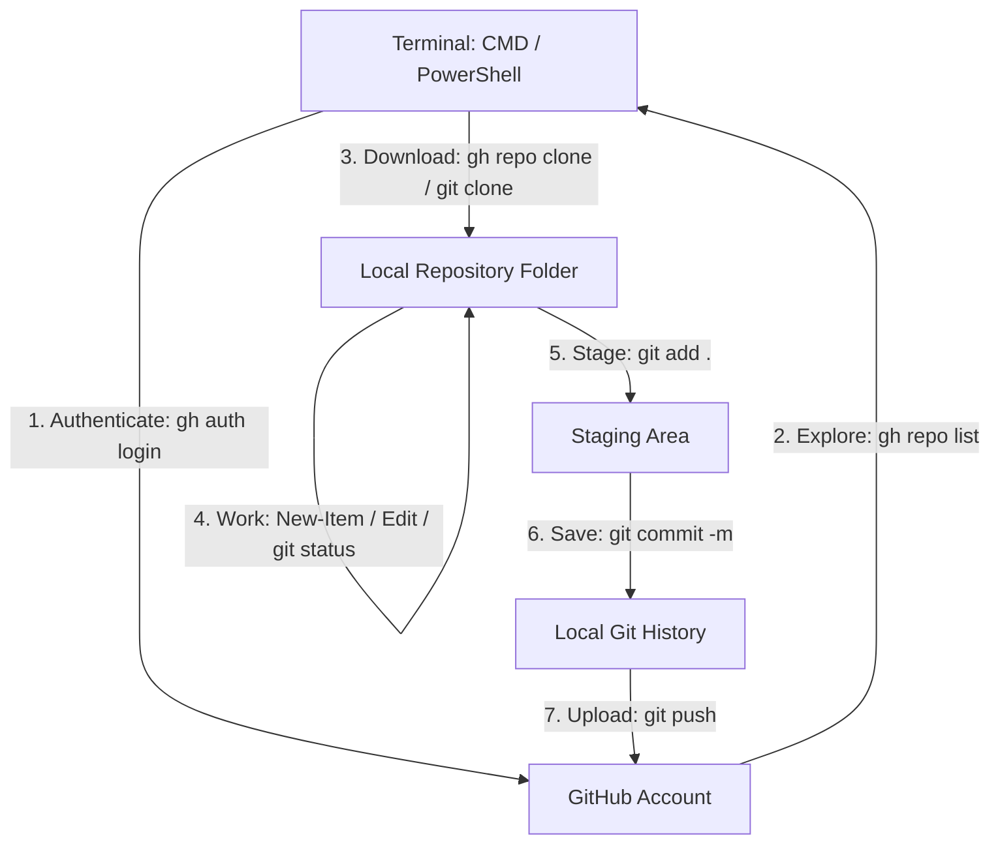

# 🚀 GitHub Access & Repository Management via CMD / PowerShell

A comprehensive, step-by-step practical guide to connecting, cloning, managing, and pushing code to GitHub directly from the Windows Command Line (`CMD`) and `PowerShell` using **GitHub CLI (`gh`)** and **Git**.

---

## 📌 Table of Contents

- [Overview & Architecture](#-overview--architecture)
- [Git vs GitHub CLI: Understanding the Difference](#-git-vs-github-cli-understanding-the-difference)
- [Prerequisites & Verification](#-prerequisites--verification)
- [Step 1: Install GitHub CLI](#step-1-install-github-cli-windows)
- [Step 2: Authenticate with GitHub](#step-2-authenticate-with-github-gh-auth-login)
- [Step 3: List Accessible Repositories](#step-3-list-accessible-repositories)
- [Step 4: Clone the Target Repository](#step-4-clone-the-target-repository)
- [Step 5: Navigate and Inspect Local Repo](#step-5-navigate-and-inspect-local-repo)
- [Step 6: Make Changes / Create New Files](#step-6-make-changes--create-new-files)
- [Step 7: Stage, Commit, and Push Changes](#step-7-stage-commit-and-push-changes)
- [Step 8: Verify Remote Updates](#step-8-verify-remote-updates)
- [⚡ Quick Reference Cheat Sheet](#-quick-reference-cheat-sheet)
- [💡 Key Interview Notes & Best Practices](#-key-interview-notes--best-practices)

---

## 🏗 Overview & Architecture

The standard modern developer workflow connects local version control (`git`) with remote cloud hosting (`GitHub`) through the official GitHub CLI (`gh`):



---

## ⚖ Git vs GitHub CLI: Understanding the Difference

| Tool | Scope | Purpose | Example Commands |
| :--- | :--- | :--- | :--- |
| **`git`** | Local VCS | Tracks changes, history, branches, and merges locally on your machine. | `git status`, `git add`, `git commit`, `git push` |
| **`gh`** (GitHub CLI) | Cloud / Remote | Interacts with GitHub APIs, manages accounts, PRs, issues, and lists remote repos. | `gh auth login`, `gh repo list`, `gh repo clone` |

> [!NOTE]
> **Common Pitfall:** Running `git repo list` will result in an error (`git: 'repo' is not a git command`). Always use **`gh repo list`** when querying GitHub from CLI!

---

## 🔍 Prerequisites & Verification

### Check Git Installation
First, verify that Git is installed and added to your system `PATH`:

```powershell
git --version
```
**Expected Output:**
```text
git version 2.49.0.windows.1 (or similar)
```
*(If Git is not installed, download it from [git-scm.com](https://git-scm.com/)).*

---

## Step 1: Install GitHub CLI (Windows)

If `gh` command is not recognized, install it using the Windows Package Manager (`winget`):

```powershell
winget install --id GitHub.cli
```

> [!IMPORTANT]
> After installation completes, **close and reopen** your CMD / PowerShell / VS Code terminal so the environment variables refresh.

Verify the installation:
```powershell
gh --version
```
**Expected Output:**
```text
gh version 2.x.x (x86_64-w64-mingw32)
```

---

## Step 2: Authenticate with GitHub (`gh auth login`)

Authenticate your terminal session with your GitHub account:

```powershell
gh auth login
```

### Interactive Prompts Guide:
1. **What account do you want to log into?** &rarr; Select `GitHub.com`
2. **What is your preferred protocol for Git operations?** &rarr; Select `HTTPS` (or `SSH` if keys are configured)
3. **Authenticate Git with your GitHub credentials?** &rarr; Select `Yes`
4. **How would you like to authenticate GitHub CLI?** &rarr; Select `Login with a web browser`
5. Copy the one-time 8-character code shown on screen, press `Enter`, and authorize in your browser.

### Verify Authentication Status
```powershell
gh auth status
```
**Expected Output:**
```text
Logged in to github.com account <your-username> (keyring)
- Active account: true
- Git operations protocol: https
```

---

## Step 3: List Accessible Repositories

List all repositories accessible to your authenticated account:

```powershell
gh repo list
```

**Sample Output:**
```text
Ashwanishahi155/faizan          public
Ashwanishahi155/axion_lab_      public
Ashwanishahi155/custom_policy   public
```

To list repositories under a specific organization:
```powershell
gh repo list ORGANIZATION_NAME
```

---

## Step 4: Clone the Target Repository

> [!WARNING]
> **GitHub Repository Name Is Not a Local Folder!**  
> In `Ashwanishahi155/faizan`, `Ashwanishahi155` is the account owner and `faizan` is the repository name. You cannot simply `cd Ashwanishahi155/faizan` without cloning it first.

1. Navigate to your desired working directory on your PC:
   ```powershell
   cd "D:\terraform project\07 sep. 2026\Amit"
   ```

2. Clone using **GitHub CLI**:
   ```powershell
   gh repo clone Ashwanishahi155/faizan
   ```
   *(Or using standard Git)*:
   ```powershell
   git clone https://github.com/Ashwanishahi155/faizan.git
   ```

---

## Step 5: Navigate and Inspect Local Repo

Switch into the cloned repository folder:

```powershell
cd faizan
```

Verify your current directory location:
```powershell
pwd
# Output: D:\terraform project\07 sep. 2026\Amit\faizan
```

Check the repository status:
```powershell
git status
```
*This shows your active branch (e.g., `main`), whether your working tree is clean, or if there are untracked changes.*

---

## Step 6: Make Changes / Create New Files

On Windows, text editors like `nano` or `vim` may not be installed by default. You can create or edit files using PowerShell commands or VS Code:

### Option A: Create an empty file
```powershell
New-Item trc.txt -ItemType File
```

### Option B: Create and write text in one command
```powershell
"Hello Faizan Repo" | Out-File trc.txt
```

### Option C: Open and edit with VS Code
```powershell
code trc.txt
```

Verify the file creation:
```powershell
ls
```

---

## Step 7: Stage, Commit, and Push Changes

### 1. Stage Changes
Check modified/untracked files:
```powershell
git status
```

Stage all changes:
```powershell
git add .
```
*(Or stage a specific file)*:
```powershell
git add trc.txt
```

### 2. Commit Changes
Save staged changes to the local Git history with a descriptive message:
```powershell
git commit -m "Add trc practice file"
```

### 3. Push to Remote Repository
Check your remote target URL:
```powershell
git remote -v
```

Push to GitHub:
```powershell
git push
```

> [!TIP]
> If Git prompts that the current branch has no upstream branch on your very first push, run:
> ```powershell
> git push -u origin main
> ```

---

## Step 8: Verify Remote Updates

1. **Locally:** Review your latest commits:
   ```powershell
   git log --oneline -n 5
   ```
2. **On GitHub:** Open your repository (`https://github.com/Ashwanishahi155/faizan`) in your web browser and refresh. Your new file (`trc.txt`) and latest commit message will be visible!

---

## ⚡ Quick Reference Cheat Sheet

| Step | Action | Command | Purpose |
| :---: | :--- | :--- | :--- |
| **1** | Verify Git | `git --version` | Confirm Git installation |
| **2** | Verify GitHub CLI | `gh --version` | Confirm GitHub CLI installation |
| **3** | Authenticate | `gh auth login` | Connect terminal to GitHub |
| **4** | Check Auth | `gh auth status` | Confirm login username & state |
| **5** | Browse Repos | `gh repo list` | View all accessible repositories |
| **6** | Download Repo | `gh repo clone <owner>/<repo>` | Clone repository to local machine |
| **7** | Navigate | `cd <repo>` | Enter cloned repository directory |
| **8** | Inspect State | `git status` | Check untracked & modified files |
| **9** | Create File | `"Content" \| Out-File filename.txt` | Create or update file |
| **10**| Stage Changes | `git add .` | Stage files for commit |
| **11**| Save Commit | `git commit -m "Your message"` | Commit changes to local history |
| **12**| Sync Remote | `git push` | Upload commits to GitHub |
| **13**| Review History| `git log --oneline` | View local commit log |

---

## 💡 Key Interview Notes & Best Practices

- **`git repo list` does not exist:** `git` has no native knowledge of account repository listings; only `gh repo list` or GitHub web APIs can list remote account repositories.
- **Repository Paths:** `Owner/Repo` is a GitHub namespace, not a Windows directory path until cloned locally.
- **The Core Git Cycle:** The fundamental flow to contribute code to any Git-based platform is:
  $$\text{Working Directory} \xrightarrow{\texttt{git add}} \text{Staging Area} \xrightarrow{\texttt{git commit}} \text{Local Repository} \xrightarrow{\texttt{git push}} \text{Remote (GitHub)}$$
- **Upstream Tracking:** Using `git push -u origin <branch>` establishes a default tracking reference so subsequent pushes require only `git push`.
