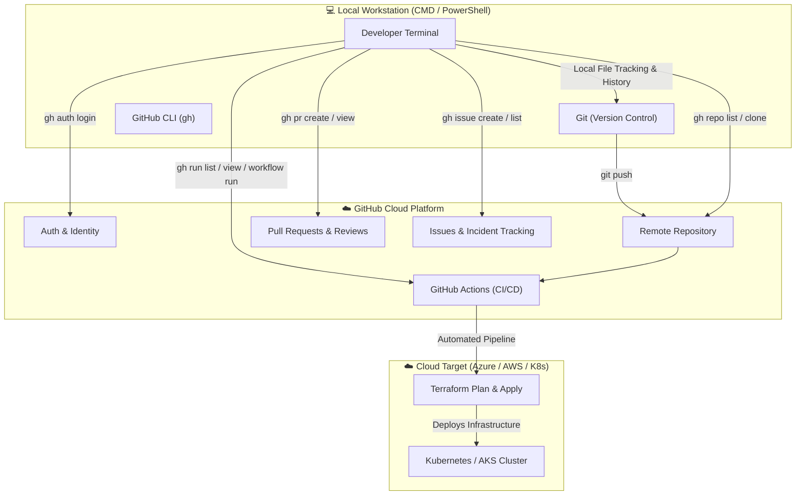
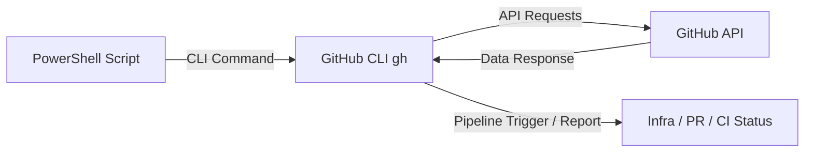

# 🚀 GitHub & DevOps CLI Master Guide: Git & GitHub CLI (`gh`)

A production-grade, step-by-step practical guide to mastering **Git** and **GitHub CLI (`gh`)** from the Windows Command Prompt (`CMD`) & `PowerShell`. Covers everyday repo operations, CI/CD pipelines, Pull Request management, issue tracking, automation scripting, and DevOps interview prep.

---

## 📌 Table of Contents

- [DevOps Architecture & Flow](#-devops-architecture--flow)
- [Git vs GitHub CLI: Command Families Distinction](#-git-vs-github-cli-command-families-distinction)
- [🚀 Major DevOps Use Cases at a Glance](#-major-devops-use-cases-at-a-glance)
- [Part 1: Hands-on Practical Setup & Daily Workflow](#part-1-hands-on-practical-setup--daily-workflow)
  - [Step 1: Check Git Installation](#step-1-check-git-installation)
  - [Step 2: Install GitHub CLI](#step-2-install-github-cli-windows)
  - [Step 3: Authenticate with GitHub](#step-3-authenticate-with-github-gh-auth-login)
  - [Step 4: List Accessible Repositories](#step-4-list-accessible-repositories)
  - [Step 5: Clone the Target Repository](#step-5-clone-the-target-repository)
  - [Step 6: Navigate and Inspect Local Repo](#step-6-navigate-and-inspect-local-repo)
  - [Step 7: Create & Edit Files (PowerShell / VS Code)](#step-7-create--edit-files-powershell--vs-code)
  - [Step 8: Stage, Commit, and Push Changes](#step-8-stage-commit-and-push-changes)
  - [Step 9: Verify Remote Updates](#step-9-verify-remote-updates)
- [Part 2: Advanced DevOps Use Cases](#part-2-advanced-devops-use-cases)
  - [1️⃣ CI/CD & GitHub Actions Pipelines](#1️⃣-cicd--github-actions-pipelines)
  - [2️⃣ Pull Request (PR) Management](#2️⃣-pull-request-pr-management)
  - [3️⃣ GitHub Issues Management](#3️⃣-github-issues-management)
  - [4️⃣ Cloud Repository Management](#4️⃣-cloud-repository-management)
  - [5️⃣ Automation & Scripting via PowerShell](#5️⃣-automation--scripting-via-powershell)
- [🎯 Real-world DevOps Scenario: Terraform on Azure](#-real-world-devops-scenario-terraform-on-azure)
- [⚡ Quick Reference Cheat Sheet](#-quick-reference-cheat-sheet)
- [💡 DevOps Interview Mastery & One-Liners](#-devops-interview-mastery--one-liners)

---

## 🏗 DevOps Architecture & Flow



---

## ⚖ Git vs GitHub CLI: Command Families Distinction

Understanding this boundary is critical for every DevOps engineer:

| Dimension | **Git (`git`)** | **GitHub CLI (`gh`)** |
| :--- | :--- | :--- |
| **Core Domain** | Local Source Code / Version Control System (VCS) | GitHub Cloud Platform Management & Automation |
| **Execution** | Operates on local filesystem and `.git` database | Communicates with GitHub REST & GraphQL APIs |
| **Scope** | Commits, branches, merges, diffs, history | Repositories, PRs, Issues, Actions (CI/CD), Releases |
| **Key Commands** | `git add`, `git commit`, `git push`, `git pull`, `git branch` | `gh repo`, `gh pr`, `gh issue`, `gh run`, `gh workflow` |

> [!NOTE]
> **Common Pitfall:** Running `git repo list` will result in `git: 'repo' is not a git command`. Always use **`gh repo list`** when querying GitHub from the terminal!

---

## 🚀 Major DevOps Use Cases at a Glance

| Use Case | Command Example | Kya Karta Hai (Purpose) |
| :--- | :--- | :--- |
| 🔐 **GitHub Login** | `gh auth login` | Terminal session ko GitHub se authenticate karta hai |
| 📂 **Repo List** | `gh repo list` | Accessible repositories ki list display karta hai |
| 📥 **Clone Repo** | `gh repo clone owner/repo` | Remote repo ko local system me clone karta hai |
| 🏗️ **Create Repo** | `gh repo create` | Terminal se direct nayi repository banata hai |
| 🔍 **Repo Info** | `gh repo view` | Repository summary aur README details dikhata hai |
| 🌿 **Pull Request** | `gh pr create` | Code review/merge ke liye direct PR create karta hai |
| 👀 **PR Check** | `gh pr list` | Active Pull Requests ki list dikhata hai |
| 🔎 **PR Details** | `gh pr view <id>` | Specific PR ke diffs, comments, aur approval checks dekhta hai |
| 🐛 **Issues** | `gh issue list` | Open bugs/tickets ki list display karta hai |
| ⚙️ **GitHub Actions**| `gh run list` | CI/CD pipeline runs aur status dekhta hai |
| 📋 **Workflow Details**| `gh run view <id>` | Failed/passed build runs ke terminal logs inspect karta hai |
| 🚀 **Workflow Trigger**| `gh workflow run <file>` | CI/CD pipeline ko manually trigger karta hai |

---

## Part 1: Hands-on Practical Setup & Daily Workflow

### Step 1: Check Git Installation
Verify that Git is installed and configured in your system `PATH`:
```powershell
git --version
```
*Expected output: `git version 2.49.0.windows.1` (or similar).*

---

### Step 2: Install GitHub CLI (Windows)
If `gh` is not recognized, install it using the Windows Package Manager (`winget`):
```powershell
winget install --id GitHub.cli
```
> [!IMPORTANT]
> Restart your PowerShell or CMD terminal window after installation so the path variables refresh.

Verify installation:
```powershell
gh --version
```

---

### Step 3: Authenticate with GitHub (`gh auth login`)
Authenticate terminal access with GitHub:
```powershell
gh auth login
```
**Recommended Interactive Selections:**
1. Account to log into: `GitHub.com`
2. Preferred Git protocol: `HTTPS`
3. Authenticate Git with credentials: `Yes`
4. Auth method: `Login with a web browser`
5. Press `Enter`, copy the 8-character one-time verification code, and approve in your browser.

**Verify login status:**
```powershell
gh auth status
```
*Output confirms: `Logged in to github.com account <username>`.*

---

### Step 4: List Accessible Repositories
```powershell
gh repo list
```
*Shows repositories like `Ashwanishahi155/faizan (public)`, etc.*

To filter by organization:
```powershell
gh repo list <ORGANIZATION_NAME>
```

---

### Step 5: Clone the Target Repository

> [!WARNING]
> In `Ashwanishahi155/faizan`, `Ashwanishahi155` is the GitHub owner and `faizan` is the repository name. You cannot `cd Ashwanishahi155/faizan` without cloning first.

Navigate to your workspace directory and clone:
```powershell
cd "D:\terraform project\07 sep. 2026\Amit"
gh repo clone Ashwanishahi155/faizan
```
*(Equivalent standard Git command: `git clone https://github.com/Ashwanishahi155/faizan.git`)*

---

### Step 6: Navigate and Inspect Local Repo
```powershell
cd faizan
pwd         # Verify current location
git status  # Check working tree and active branch
```

---

### Step 7: Create & Edit Files (PowerShell / VS Code)

On Windows without `nano` or `vim`:
- **Create an empty file:**
  ```powershell
  New-Item trc.txt -ItemType File
  ```
- **Write content directly:**
  ```powershell
  "Hello Faizan Repo" | Out-File trc.txt
  ```
- **Open in editor:**
  ```powershell
  code trc.txt
  ```
- **List directory contents:**
  ```powershell
  ls
  ```

---

### Step 8: Stage, Commit, and Push Changes

1. **Stage files:**
   ```powershell
   git add .
   # or stage specific file: git add trc.txt
   ```
2. **Commit with descriptive message:**
   ```powershell
   git commit -m "Add trc practice file"
   ```
3. **Verify remote and push:**
   ```powershell
   git remote -v
   git push
   ```
   > [!TIP]
   > For the very first push to set the upstream tracking branch:
   > ```powershell
   > git push -u origin main
   > ```

---

### Step 9: Verify Remote Updates
```powershell
git log --oneline -n 5
```
Open your GitHub repository in the browser: your new commit and files will be live.

---

## Part 2: Advanced DevOps Use Cases

### 1️⃣ CI/CD & GitHub Actions Pipelines 🔥

**Ye interview ke liye sabse important use case hai.**

Jab developer code push karta hai:
$$\text{Developer} \xrightarrow{\texttt{git push}} \text{GitHub Repo} \xrightarrow{\text{Trigger}} \text{GitHub Actions} \xrightarrow{\text{Execute}} \text{Terraform / Docker / K8s} \xrightarrow{\text{Deploy}} \text{Azure}$$

**Industry Reality:** Deployment fail hone par browser kholne ki zaroorat nahi hai. DevOps engineers terminal se hi pipelines inspect aur rerun karte hain.

- **Check pipeline status across branches:**
  ```powershell
  gh run list
  ```
  *Example Output:*
  ```text
  STATUS    WORKFLOW          BRANCH         EVENT    ID
  ✓         Terraform CI      main           push     8492019
  ✓         Docker Build      main           push     8492020
  ✗         Deploy AKS        feature/login  push     8492021
  ```

- **Inspect a specific run's failure logs:**
  ```powershell
  gh run view 8492021 --log-failed
  ```

- **Rerun failed jobs without touching GitHub UI:**
  ```powershell
  gh run rerun 8492021 --failed
  ```

- **Manually trigger a workflow (Workflow Dispatch):**
  ```powershell
  gh workflow run terraform.yml
  ```

---

### 2️⃣ Pull Request (PR) Management

Standard Enterprise Git Flow:
$$\text{Feature Branch} \xrightarrow{\texttt{gh pr create}} \text{Pull Request} \xrightarrow{\text{Code Review \& CI Checks}} \text{Merge to Main}$$

- **List active Pull Requests:**
  ```powershell
  gh pr list
  ```
- **Create a Pull Request from current branch:**
  ```powershell
  gh pr create --title "Provision Azure Virtual Network" --body "Adds Terraform modules for VNet and subnets."
  ```
- **Inspect PR status, checks, and approvals:**
  ```powershell
  gh pr view 25
  ```
- **Checkout a teammate's PR locally for verification:**
  ```powershell
  gh pr checkout 25
  ```
- **Approve and merge a PR directly:**
  ```powershell
  gh pr review 25 --approve
  gh pr merge 25 --squash --delete-branch
  ```

---

### 3️⃣ GitHub Issues Management 🐛

DevOps teams track infrastructure incidents, pipeline failures, and bugs via Issues:

- **List open issues:**
  ```powershell
  gh issue list
  ```
- **Create a new incident issue:**
  ```powershell
  gh issue create --title "Terraform apply failed on AKS subnet" --body "Error: Subnet CIDR collision in EastUS."
  ```
- **View issue details:**
  ```powershell
  gh issue view 15
  ```
- **Close resolved issue:**
  ```powershell
  gh issue close 15 --comment "Resolved via PR #26."
  ```

---

### 4️⃣ Cloud Repository Management 📂

- **Create a new repository under your account:**
  ```powershell
  gh repo create my-terraform-project --public --clone
  ```
- **Inspect repository details:**
  ```powershell
  gh repo view
  ```
- **Open the repo in default web browser:**
  ```powershell
  gh repo view --web
  ```

---

### 5️⃣ Automation & Scripting via PowerShell 🤖

The true power of `gh` in DevOps is headless scripting. Because `gh` communicates with GitHub APIs and supports formatted JSON output, it integrates seamlessly into PowerShell automation:



**Practical PowerShell Script Example:** Check all failing runs and report them automatically:
```powershell
# Get all failed pipeline runs in JSON format and output workflow name
$failedRuns = gh run list --json status,conclusion,workflowName,databaseId | ConvertFrom-Json | Where-Object { $_.conclusion -eq "failure" }

foreach ($run in $failedRuns) {
    Write-Host "⚠️ Warning: Workflow '$($run.workflowName)' (ID: $($run.databaseId)) has failed!" -ForegroundColor Red
}
```

---

## 🎯 Real-world DevOps Scenario: Terraform on Azure

Suppose you are managing a Terraform project deployed to Azure:

$$\text{Terraform Project} \rightarrow \text{GitHub PR} \rightarrow \text{GitHub Actions} \rightarrow \text{Terraform Plan} \rightarrow \text{Approval} \rightarrow \text{Terraform Apply} \rightarrow \text{Azure Cloud}$$

### How a DevOps Engineer Uses `gh` on this project:
1. **Check PRs awaiting infra review:**
   ```powershell
   gh pr list
   ```
2. **Review Terraform Plan output from Actions:**
   ```powershell
   gh run list
   gh run view <run-id>
   ```
3. **Investigate failed Terraform validation:**
   ```powershell
   gh run view <run-id> --log-failed
   ```
4. **Trigger scheduled Terraform apply manually:**
   ```powershell
   gh workflow run terraform-apply.yml
   ```

---

## ⚡ Quick Reference Cheat Sheet

| Category | Command | What It Does |
| :--- | :--- | :--- |
| **Auth** | `gh auth login` | Interactive terminal login |
| **Auth** | `gh auth status` | Verify authentication state |
| **Repo** | `gh repo list` | List available repositories |
| **Repo** | `gh repo clone <owner>/<repo>` | Clone repository |
| **Repo** | `gh repo create <name> --public` | Create new remote repository |
| **Git Basic** | `git status` | Show local working tree status |
| **Git Basic** | `git add .` | Stage all modified and new files |
| **Git Basic** | `git commit -m "msg"` | Commit staged files to local log |
| **Git Basic** | `git push -u origin <branch>` | Push commits and set upstream branch |
| **PR** | `gh pr list` | List open Pull Requests |
| **PR** | `gh pr create` | Create PR interactively |
| **PR** | `gh pr view <id>` | View PR description and checks |
| **PR** | `gh pr checkout <id>` | Switch branch to target PR |
| **CI/CD** | `gh run list` | View recent CI/CD pipeline runs |
| **CI/CD** | `gh run view <id>` | View workflow execution details & logs |
| **CI/CD** | `gh workflow run <file.yml>` | Manually trigger workflow dispatch |
| **Issues** | `gh issue list` | List tracked bugs/issues |
| **Issues** | `gh issue create` | Open new tracking issue |

---

## 💡 DevOps Interview Mastery & One-Liners

> [!IMPORTANT]
> **Interview Punchline (Memorize this!):**  
> *"GitHub CLI (`gh`) enables DevOps engineers to manage GitHub repositories, pull requests, issues, and GitHub Actions pipelines directly from the terminal, making it essential for automation, troubleshooting, and streamlined CI/CD operations without context-switching to a browser."*

### Key Points for Interviews:
- **`git` vs `gh`**: `git` is local decentralized source control; `gh` is GitHub's official management interface over cloud APIs.
- **Troubleshooting Speed**: Instead of opening web dashboards during an incident, engineers use `gh run list` and `gh run view --log-failed` to identify pipeline failures in seconds.
- **Automation Advantage**: `gh` supports flags like `--json` and `--jq`, making it trivial to parse results in Bash or PowerShell CI scripts.
- **Security**: `gh auth login` uses modern web tokens and OAuth device flows, eliminating the need to hardcode passwords or personal access tokens in local shells.
