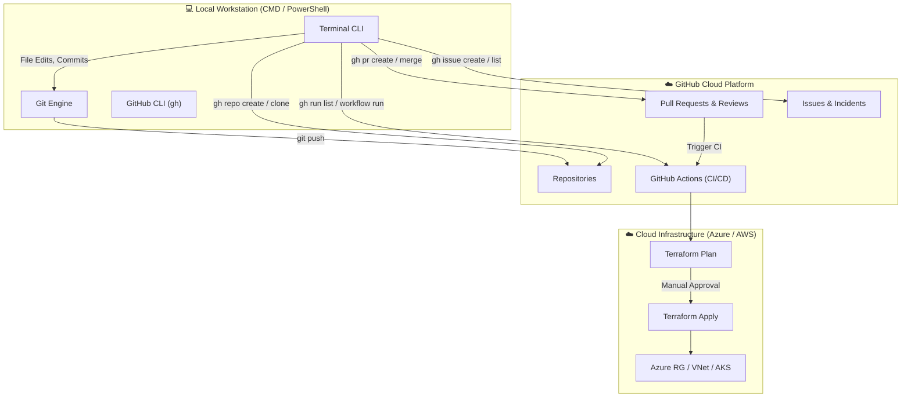

# 🚀 GitHub CLI DevOps Labs (`github-cli-devops-labs`)

A comprehensive, production-grade **DevOps Practical Lab Curriculum** for mastering **Git** and **GitHub CLI (`gh`)** directly from the Windows Command Prompt (`CMD`) and `PowerShell`.

---

## 📂 Laboratory Repository Structure

```text
github-cli-devops-labs
│
├── 01-installation          # Lab 01: Git & GitHub CLI verification and installation
│   └── README.md
│
├── 02-gh-auth-login         # Lab 02: Browser/Token authentication & credential setup
│   └── README.md
│
├── 03-repository            # Lab 03: List, view, clone, create, & rename cloud repos
│   └── README.md
│
├── 04-branch                # Lab 04: GitFlow branching, checkout, switch & upstream
│   └── README.md
│
├── 05-pull-request          # Lab 05: PR creation, review, approvals, diffs & merges
│   └── README.md
│
├── 06-issues                # Lab 06: Incident tracking, ticketing & bug lifecycle
│   └── README.md
│
├── 07-github-actions        # Lab 07: CI/CD monitoring, viewing failed logs & dispatch
│   └── README.md
│
├── 08-azure-devops          # Lab 08: Cloud secrets, Azure integration & Terraform
│   └── README.md
│
├── 09-automation            # Lab 09: JSON, JQ parsing & PowerShell automation scripts
│   └── README.md
│
└── README.md                # Master Curriculum & End-to-End Command Reference
```

---

## 📑 Curriculum & Lab Index

| Lab | Module Title | Primary Commands Covered | Lab Link |
| :---: | :--- | :--- | :---: |
| **01** | **Installation & Setup** | `git --version`, `winget install`, `gh --version` | [Open Lab 01](../01-installation/README.md) |
| **02** | **Authentication & Security** | `gh auth login`, `gh auth status`, `gh auth setup-git` | [Open Lab 02](../02-gh-auth-login/README.md) |
| **03** | **Repository Operations** | `gh repo list`, `gh repo view`, `gh repo clone`, `gh repo create`, `gh repo rename` | [Open Lab 03](../03-repository/README.md) |
| **04** | **Branching Strategy** | `git branch`, `git checkout -b`, `git switch -c`, `git push -u` | [Open Lab 04](../04-branch/README.md) |
| **05** | **Pull Request Management**| `gh pr create`, `gh pr list`, `gh pr view`, `gh pr review`, `gh pr merge`, `gh pr checkout` | [Open Lab 05](../05-pull-request/README.md) |
| **06** | **Issues & Incident Tracking**| `gh issue create`, `gh issue list`, `gh issue view`, `gh issue close`, `gh issue reopen` | [Open Lab 06](../06-issues/README.md) |
| **07** | **GitHub Actions (CI/CD)** | `gh workflow list`, `gh workflow run`, `gh run list`, `gh run view --log-failed`, `gh run rerun` | [Open Lab 07](../07-github-actions/README.md) |
| **08** | **Azure & Cloud Integration**| `gh secret set`, `gh secret list`, `gh variable set`, Terraform on Azure | [Open Lab 08](../08-azure-devops/README.md) |
| **09** | **Automation & Scripting** | `--json`, `--jq`, `ConvertFrom-Json`, PowerShell automation scripts | [Open Lab 09](../09-automation/README.md) |

---

## ⚡ End-to-End CMD / PowerShell Command Reference

```powershell
# ==========================================
# 1. AUTHENTICATION & ENVIRONMENT CHECK
# ==========================================
gh --version                      # Check GitHub CLI version
gh auth login                     # Interactive login via web browser
gh auth status                    # Verify logged in account and active scopes

# ==========================================
# 2. REPOSITORY MANAGEMENT
# ==========================================
gh repo list                      # List accessible repositories
gh repo view <owner>/<repo>       # View repository summary & README
gh repo clone <owner>/<repo>      # Clone repository to local machine
gh repo create <name> --public    # Create a new GitHub repository
gh repo rename <new-name>         # Rename remote repository directly

# ==========================================
# 3. BRANCHING (VCS)
# ==========================================
git branch                        # List local branches
git branch -a                     # List all local and remote branches
git checkout -b <branch-name>     # Create and switch branch (classic)
git switch -c <branch-name>       # Create and switch branch (modern)
git switch <branch-name>          # Switch between existing branches

# ==========================================
# 4. PULL REQUEST MANAGEMENT
# ==========================================
gh pr create                      # Create PR interactively
gh pr list                        # List active pull requests
gh pr view <pr-id>                # View PR details and checks
gh pr review <pr-id> --approve    # Approve PR review from terminal
gh pr merge <pr-id> --squash      # Merge PR and delete remote branch
gh pr checkout <pr-id>            # Checkout teammate PR locally

# ==========================================
# 5. ISSUE & INCIDENT TRACKING
# ==========================================
gh issue create                   # Create new bug or incident issue
gh issue list                     # List open issues
gh issue view <issue-id>          # View issue thread and discussion
gh issue close <issue-id>         # Close and resolve issue

# ==========================================
# 6. GITHUB ACTIONS & CI/CD PIPELINES
# ==========================================
gh workflow list                  # List all YAML workflows
gh workflow run <workflow.yml>    # Manually trigger workflow dispatch
gh run list                       # List recent CI/CD pipeline runs
gh run view <run-id>              # View pipeline execution summary
gh run view <run-id> --log-failed # Inspect exact failed logs directly in terminal
gh run rerun <run-id> --failed    # Rerun only failed jobs

# ==========================================
# 7. AUTOMATION & SCRIPTING
# ==========================================
gh repo list --json name,isPrivate --jq '.[].name'
gh run list --json status,conclusion | ConvertFrom-Json
```

---

## 🏗 DevOps Architecture: End-to-End Lifecycle



---

## ⚖ Git vs GitHub CLI: Conceptual Distinction

| Dimension | **Git (`git`)** | **GitHub CLI (`gh`)** |
| :--- | :--- | :--- |
| **Domain** | Local Version Control System (VCS) | GitHub Cloud Platform & API Automation |
| **Execution** | Local machine & `.git` folder | GitHub Cloud REST & GraphQL Endpoints |
| **Responsibility** | Code history, commits, branches, merges | Repositories, PRs, Issues, Actions, Secrets |
| **Command Families** | `git add`, `git commit`, `git push`, `git pull`, `git switch` | `gh repo`, `gh pr`, `gh issue`, `gh run`, `gh workflow`, `gh secret` |

> [!NOTE]
> **Key Interview Rule:** `git repo list` does NOT exist in Git. Querying remote GitHub data requires **`gh repo list`**.

---

## 🎯 Real-world DevOps Project Flow (Terraform on Azure)

In production enterprise environments (e.g. Terraform infrastructure deployed on Azure Cloud):

$$\text{Terraform Project} \rightarrow \text{GitHub PR} \rightarrow \text{GitHub Actions} \rightarrow \text{Terraform Plan} \rightarrow \text{Approval} \rightarrow \text{Terraform Apply} \rightarrow \text{Azure Cloud}$$

### How a DevOps Engineer Uses `gh` Everyday:
1. **Check open PRs:**
   ```powershell
   gh pr list
   ```
2. **Review CI/CD Pipeline Runs:**
   ```powershell
   gh run list
   ```
3. **Debug a Failed Infrastructure Step:**
   ```powershell
   gh run view <run-id> --log-failed
   ```
4. **Trigger Terraform Apply:**
   ```powershell
   gh workflow run terraform-apply.yml
   ```

---

## 💡 DevOps Interview Punchlines

> [!IMPORTANT]
> **One-Liner for Interviews:**  
> *"GitHub CLI (`gh`) allows DevOps engineers to interact with GitHub repositories, pull requests, issues, releases, and GitHub Actions directly from the command line, enabling fast incident troubleshooting and seamless headless CI/CD automation."*

- **Fast Troubleshooting:** Deployment fail hone par browser kholne ki zaroorat nahi hoti; terminal se `gh run view --log-failed` karke 5 seconds me root cause trace kiya jata hai.
- **Scripting & Headless Workflows:** `--json` aur `--jq` flags ke through PowerShell / Bash scripts me direct integrate karke automated Slack/Teams notifications aur branch cleanup kiye jaate hain.
- **Enterprise Security:** `gh auth login` industry-standard OAuth device tokens use karta hai, jisse hardcoded Personal Access Tokens (PAT) shell history me expose nahi hote.
